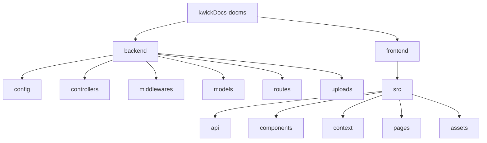

# Forensic Product Document Management System

      

---

<div align="center">
  
</div>

---

## 📖 Table of Contents
<details open>
<summary>Click to expand</summary>

- [🗂️ Project Overview](#️-project-overview)
- [❓ Problem Statement](#-problem-statement)
- [💡 Solution](#-solution)
- [✨ Key Features](#-key-features)
- [🛠️ Technology Stack](#-technology-stack)
- [🏗️ System Architecture](#-system-architecture)
- [📁 Project Folder Structure](#-project-folder-structure)
- [🗄️ Database Design](#-database-design)
- [🚀 API Endpoints Summary](#-api-endpoints-summary)
- [⚙️ Installation Guide](#-installation-guide)
- [🔧 Environment Variables](#-environment-variables)
- [📸 Project Screenshots](#-project-screenshots)
- [🔮 Future Improvements](#-future-improvements)
- [📖 Learning Outcomes](#-learning-outcomes)
- [👤 Author](#-author)
- [⚖️ License](#-license)
- [🙌 Acknowledgements](#-acknowledgements)

</details>

---

## 🗂️ Project Overview
The Forensic Product Document Management System was conceived to give a single, secure platform for managing the extensive portfolio of cybersecurity and digital‑forensic products within an organization. A sole Administrator can onboard employees, curate product listings, and host all related resources—brochures, technical specifications, presentations, manuals, tenders, and training materials—while employees log in with their credentials, browse products intuitively, and retrieve the latest documents without needing internal identifiers. Every view and download is automatically logged, offering full accountability and auditability, all behind robust JWT‑based authentication and role‑based access controls.

---

## ❓ Problem Statement
Before this system, documents were scattered across shared drives, causing version chaos, security gaps, and inefficient retrieval.

---

## 💡 Solution
A single web portal that stores every document, enforces **JWT + HttpOnly cookies**, manages product‑wise versions, and logs every view/download activity.

---

## ✨ Key Features
- JWT authentication & secure cookies
- Role‑based access (Admin & Employee)
- Product CRUD and organization
- Secure file upload & download (Multer)
- Document versioning with latest‑version flag
- Full‑text product search
- Audit logs for view/download actions
- Responsive UI for desktop & mobile
- Well‑documented REST APIs

---

## 🛠️ Technology Stack
**Frontend**: React, Tailwind CSS, Axios
**Backend**: Node.js, Express, MongoDB, Mongoose, JWT, Multer
**Tools**: Git, GitHub, Postman, VS Code

---

## 🏗️ System Architecture
```mermaid
flowchart TD
    UI[React UI] -->|Axios| API[Express API]
    API --> Auth[Auth Middleware (JWT)]
    API --> Docs[Document Router]
    API --> Prod[Product Router]
    API --> Audit[AuditLog Router]
    Auth --> DB[(MongoDB)]
    Docs --> FS[File System / Cloudinary]
    Prod --> DB
    Audit --> DB
```
---

## 📁 Project Folder Structure

---

## 🗄️ Database Design
- **users** – `_id`, `name`, `email`, `password`, `role`
- **products** – `_id`, `name`, `description`, timestamps
- **documents** – `_id`, `productId`, `filename`, `url`, `version`, `isLatest`, `uploadedBy`, `uploadedAt`
- **auditlogs** – `_id`, `userId`, `action`, `documentId`, `timestamp`

---

## 🚀 API Endpoints Summary
- `POST /api/auth/register` – register new user
- `POST /api/auth/login` – login, sets HttpOnly JWT cookie
- `GET /api/auth/me` – get current user (protected)
- `GET /api/products` – list/search products (protected)
- `POST /api/products` – create product (admin only)
- `PUT /api/products/:id` – update product (admin only)
- `DELETE /api/products/:id` – delete product (admin only)
- `POST /api/documents/:productId` – upload document (admin)
- `GET /api/documents/:id` – download / view document (protected)
- `GET /api/audit-logs` – list audit entries (admin only)

---

## ⚙️ Installation Guide
```bash
# Clone the repository
git clone <repository-url>
cd kwickDocs-docms
```
**Frontend**
```bash
cd frontend
npm install
npm run dev   # Vite dev server at http://localhost:5174
```
**Backend**
```bash
cd ../backend
npm install
npm run dev   # Nodemon server at http://localhost:5000
```
---

## 🔧 Environment Variables
Create a **.env** file in the **backend** folder:
```
PORT=5000
MONGODB_URI=your_mongodb_connection_string
JWT_SECRET=your_strong_secret_key
# Optional Cloudinary settings
CLOUDINARY_NAME=...
CLOUDINARY_KEY=...
CLOUDINARY_SECRET=...
```
Frontend uses `VITE_API_URL` (see `frontend/.env.example`).
---

## 📸 Project Screenshots
| # | Screenshot | Description |
|---|------------|-------------|
| 1️⃣ |  | Secure login page for admins & employees |
| 2️⃣ |  | Central dashboard with product overview |
| 3️⃣ |  | Admin product management UI |
| 4️⃣ |  | Document upload form |
| 5️⃣ |  | Employee view of latest documents |
| 6️⃣ |  | Document metadata & version info |
| 7️⃣ |  | Audit log panel for admin |
| 8️⃣ |  | Mobile‑responsive layout |
> Replace the placeholder images in the `screenshots/` folder with actual screenshots.
---

## 🔮 Future Improvements
- Cloud storage integration (AWS S3 / Cloudinary)
- Granular permission matrix per product
- Full‑text search with Elasticsearch
- Automated test suite (Jest & Supertest)
- CI/CD pipeline via GitHub Actions
---

## 📖 Learning Outcomes
- Built a production‑grade MERN app with JWT & HttpOnly cookies
- Implemented role‑based access control and audit logging
- Designed document versioning logic
- Gained experience with Tailwind CSS and Multer
- Practised API design, error handling, and secure backend architecture
---

## 👤 Author
**Samarjit Singh** – Software Development Intern at Kwick Forensic Solutions Pvt. Ltd.
- Email: samarjit@example.com
- LinkedIn: https://linkedin.com/in/samarjit-singh
- GitHub: https://github.com/samarjit-singh
---

## ⚖️ License
This project is licensed under the MIT License.
---

## 🙌 Acknowledgements
Thanks to the open‑source communities behind React, Node, Express, MongoDB, TailwindCSS, and all the tools used in this project.
